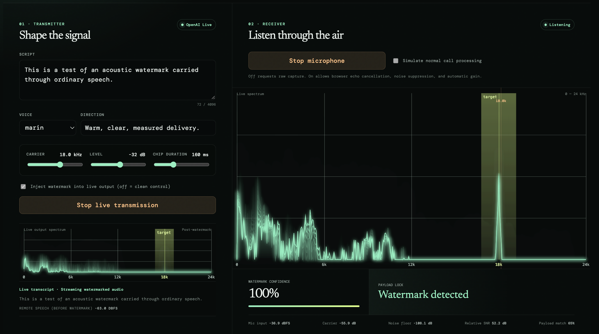

# Audio Watermark Lab

A local browser experiment for streaming OpenAI Live speech, applying a near-ultrasonic acoustic watermark immediately before speaker output, and detecting the carrier through a microphone.

The transmitter and receiver are independent: use both on one computer, or open receiver mode on one device while playing saved audio from another.



## Why this exists

This experiment was inspired by an [Instagram post about multiple mobile AI agents speaking to each other](https://www.instagram.com/p/Dbj6mf-Rscq/). It asks a practical question: if AI voice output crosses a room and becomes another agent's microphone input, can the receiving application recognize that it is hearing synthesized agent speech and apply a policy before treating it as ordinary human input?

The prototype does not claim to solve provenance. It demonstrates the signal-processing loop: generate speech, insert a known acoustic pattern before speaker output, capture it with a microphone, and distinguish that pattern from ordinary target-frequency noise.

## What the screen shows

The screenshot uses combined mode:

- **Transmitter** creates a one-shot OpenAI Live response from the script, routes the decoded remote track through the browser's audio processor, and optionally adds the watermark before output reaches the speakers.
- **Live output spectrum** is the post-processing signal. The narrow peak at the highlighted 18 kHz target is the injected carrier; lower-frequency content is the generated speech.
- **Receiver** reads an independent microphone stream. Its spectrum shows what actually survived the speaker-to-microphone path, rather than reusing the transmitter's source buffer.
- **Carrier present** means the microphone sees elevated energy at the configured target frequency. **Watermark detected** requires that energy to follow the expected repeated 17-chip on/off pattern as well.
- Turning off **Inject watermark into live output** provides the clean control: speech continues playing, but the carrier is not inserted and the receiver should remain unlocked.

## Signal path

```text
Script
  -> local server creates OpenAI Live WebRTC session
  -> browser receives decoded remote audio
  -> watermark mixer (clean bypass or 15–20 kHz chip sequence)
  -> browser speakers
  -> air / room / microphone
  -> receiver spectrum + carrier test + chip-pattern correlation
  -> carrier state or payload lock
```

## Run locally

1. Copy `.env.example` to `.env` and add your OpenAI API key.
2. Install dependencies with `npm install`.
3. Start both local processes with `npm run dev`.
4. Open `http://localhost:5173`.

The API key stays in the local server and is never sent to browser code.

## Current experiment

- OpenAI Live WebRTC speech generation, started from the transmitter controls
- In-browser realtime watermark processing immediately before speaker playback
- Configurable 15–20 kHz carrier and watermark level
- Pseudorandom on/off carrier pattern with raised-cosine chip edges mixed in the browser
- Microphone capture with raw-ish or normal call-processing constraints
- Live spectrum, carrier SNR estimate, carrier presence, and repeated-pattern correlation
- Separate transmitter, receiver, and combined page modes

## Architecture

`AudioSourceProvider` isolates encoded batch generation from watermark processing. `StreamingAudioSourceProvider` is the parallel boundary for providers that deliver PCM chunks, while `LiveAudioSourceProvider` manages the WebRTC session and routes its decoded remote track into the same watermark mixer. Both converge on normalized PCM: `normalizePcmChunk` converts interleaved signed-16 or float32 chunks to per-channel floats, and `mixWatermarkChannel` accepts a chunk plus its absolute sample offset. Playback, visualization, and receiver analysis remain downstream from that stage.

The local Express server creates the OpenAI Live session with `OPENAI_API_KEY`; browser code receives only the WebRTC answer and never the standard OpenAI credential.

## Experiment procedure

1. Start the receiver with call processing **off**. Its Mic input dBFS readout should change with speech or a clap.
2. Select **Inject watermark into live output** for the marked path, or clear it for the clean-bypass control. The selected mode is fixed for the duration of a live session.
3. Start a live transmission. The browser creates a receive-only WebRTC session through the local server and sends your script as text to OpenAI Live.
4. The returned speech is mixed with a continuous, phase-stable watermark in a browser audio processor before reaching the speakers. The source panel shows the actual post-processor spectrum and a streamed transcript. The transmitter remains active after the spoken response completes so you can observe the carrier and maintained receiver lock; use **Stop live transmission** to end it. The receiver should first show **Carrier present**, then **Watermark detected** after it has observed approximately one 17-chip pattern (about 2.7 seconds at the default 160 ms chip duration). Once synchronized, the lock is held while the carrier is refreshed within a lease longer than the expected off-chip run; increase chip duration when room acoustics blur the pattern.
5. For an acoustic test, use speakers rather than headphones and point the microphone at them. Start with moderate volume, then compare the clean-bypass and watermarked modes, as well as raw-ish capture against normal call processing.
6. Stop the live transmission when finished. Live sessions may be billed by the provider even when short-lived.

## Limitations

This is an experimental detector, not a production provenance system. A display FFT shows the broad spectrum while a separate short, unsmoothed detector FFT resolves the 160 ms chips for repeated-pattern correlation. Carrier presence and a 64% payload-match threshold are both required for a lock; calibrate this threshold against clean recordings when changing hardware. Detection remains sensitive to resampling, codec loss, room response, browser microphone processing, and near-ultrasonic device roll-off. It does not authenticate a cryptographic payload, recover arbitrary data, or prove audio origin. Browser APIs also cannot create a true acoustic loopback without the speakers-and-microphone path. OpenAI Live access must be enabled for the project API key; if it is not, the local server returns a safe session-start error.
